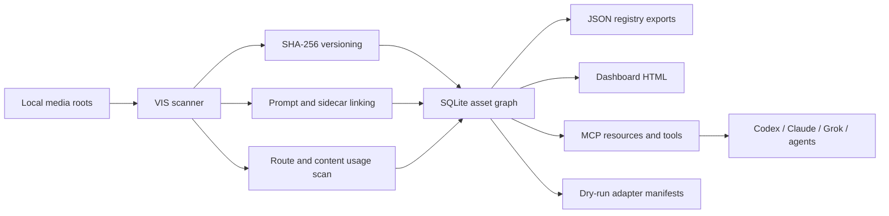

# Visual Intelligence OS Architecture

## Shape

VIS extends the existing repo instead of replacing it:

- `core/`: scanner, SQLite schema, graph APIs, scoring, packets, manifests.
- `bin/`: CLI entrypoint.
- `mcp/`: read-first MCP server for coding agents.
- `web/`: local dashboard HTML exporter.
- `schemas/`: JSON contracts for assets, provenance, and curation packets.
- `docs/`: product, workflow, security, research, and integration doctrine.

This is intentionally dependency-light. It uses Node's `node:sqlite` runtime instead of native npm SQLite packages.

## Data Flow



## Canonical IDs

- `asset_id`: logical asset id. V0 derives it from SHA-256 content hash so duplicate bytes resolve to one asset.
- `version_id`: immutable version id derived from file bytes plus media type.
- `provenance_event_id`: stable append-only event id for indexing, prompt linking, publication recording, evaluation, upload, and future generation/edit events.

## Core Tables

- `asset`
- `asset_version`
- `asset_location`
- `asset_usage`
- `asset_derivative`
- `prompt`
- `generation_event`
- `agent_run`
- `skill_run`
- `publication`
- `collection`
- `collection_item`
- `rights_record`
- `eval_record`
- `storage_object`
- `provenance_event`

## Generation Sidecars

Generated media can carry a portable sidecar next to the asset:

```text
my-image.png
my-image.vis.provenance.json
```

VIS scans this file automatically and records:

- prompt and negative prompt in `prompt`
- provider, model, seed, settings, and output paths in `generation_event`
- coding/media agent, repo, thread, and session in `agent_run`
- skill/plugin name and metadata in `skill_run`
- append-only `generation-provenance-recorded` evidence in `provenance_event`

The schema lives at `schemas/vis-provenance-sidecar.schema.json`. Agents can also record the same data without a preexisting file:

```powershell
node bin\vis.mjs record-generation <asset> --prompt "..." --model gpt-image-1 --provider openai --agent codex --skill imagegen
node bin\vis.mjs record-generation <asset> --prompt "..." --model gpt-image-1 --provider openai --agent codex --skill imagegen --write-sidecar --execute
```

The MCP tool is `record_generation_provenance`. MCP writes remain disabled unless the server is started with `VIS_ENABLE_WRITES=1` and the tool call includes `execute: true`.

## Creative Vault Contract

VIS treats Google Drive/OneDrive/Eagle as external storage surfaces, not as the database of truth. The Creative Vault planner defines the cross-device folder contract for:

- mobile exports from Google Photos/phone apps
- Eagle library storage and browsing
- approved masters
- website/social derivatives
- NFT/Web3 collections
- Music IS media handoff
- prompt/provenance evidence
- agent outputs

`vault-plan` is read-only. `vault-init --execute` creates folders and writes `_MANIFESTS/vis-vault-manifest.json` plus `README_VIS_VAULT.md`. MCP exposes the same flow through `plan_creative_vault` and `init_creative_vault`, with writes gated by `VIS_ENABLE_WRITES=1` and `execute: true`.

## Asset Action Recipes

VIS has an Eagle-inspired but VIS-native recipe layer. Recipes select assets from the graph, propose curation writes, and persist through existing annotation, collection, rights-review, and provenance paths only after explicit execution.

## Smart Collections

VIS smart collections are live, read-first queues over the SQLite graph. They give the dashboard, CLI, MCP server, and future desktop/PWA app the same Eagle-style views without duplicating filter logic.

Initial smart collections:

- `inbox`
- `rights-review`
- `prompt-gaps`
- `provenance-gaps`
- `website-used`
- `orphans`
- `duplicates`
- `similar-review`
- `curated`
- `favorites`
- `unannotated`
- `music`
- `video-motion`
- `nft-web3`
- `website-ready`
- `social-ready`

Actionable smart collections expose an attached dry-run recipe. The write boundary stays in the recipe runner: the smart view is read-only, the recipe dry-run is safe, and persistence still requires explicit `--execute` or MCP `VIS_ENABLE_WRITES=1` plus `execute: true`.

## Asset Action Recipe Catalog

Initial recipes:

- `designer-inbox`
- `music-release-inbox`
- `prompt-gap-review`
- `provenance-gap-review`
- `website-candidates`
- `social-candidates`
- `nft-trait-review`
- `orphan-review`
- `duplicate-review`
- `similar-review`

Recipes do not delete files, upload media, publish posts, mint NFTs, or auto-approve rights. They create repeatable review queues and MCP-safe action plans for agents.

## Agent Interfaces

MCP resources:

- `visual://asset/{asset_id}`
- `visual://asset/{asset_id}/versions`
- `visual://asset/{asset_id}/provenance`
- `visual://collection/{collection_id}`
- `visual://brand/{brand}/approved`

MCP tools:

- `search_assets`
- `get_asset`
- `trace_asset`
- `map_usage`
- `find_duplicates`
- `find_orphans`
- `score_asset`
- `score_collection`
- `create_curation_packet`
- `plan_creative_vault`
- `init_creative_vault`
- `list_smart_collections`
- `evaluate_smart_collection`
- `list_asset_action_recipes`
- `run_asset_action_recipe`
- `record_generation_provenance`
- `record_publication`
- `export_cloudinary_manifest`
- `export_nft_metadata_report`

## Compatibility

VIS still exports `data/visual-registry.json` for old tooling. The new source of truth is `data/vis.sqlite`.

## Next Architecture Step

The static dashboard is the first local UI. The data contract is already suitable for a future Next.js or Tauri app without changing the scanner, MCP server, or schemas.
