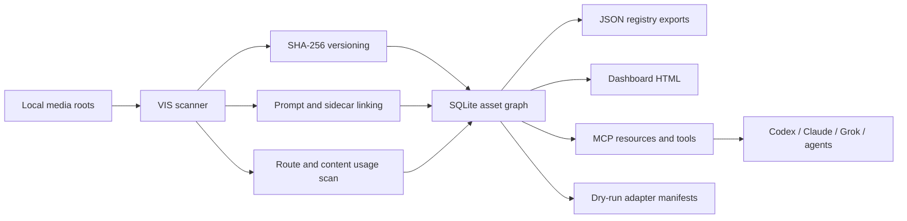

# Visual Intelligence OS Architecture

## Shape

VIS extends the existing repo instead of replacing it:

- `core/`: scanner, SQLite schema, graph APIs, scoring, packets, manifests.
- `bin/`: CLI entrypoint.
- `mcp/`: read-first MCP server for coding agents.
- `web/`: local dashboard HTML exporter.
- `schemas/`: JSON contracts for assets, provenance, and curation packets.
- `docs/`: product, workflow, security, research, and integration doctrine.

This is intentionally dependency-light. It uses Node's `node:sqlite` runtime instead of native npm SQLite packages.

## Data Flow

## Canonical IDs

- `asset_id`: logical asset id. V0 derives it from SHA-256 content hash so duplicate bytes resolve to one asset.
- `version_id`: immutable version id derived from file bytes plus media type.
- `provenance_event_id`: stable append-only event id for indexing, prompt linking, publication recording, evaluation, upload, and future generation/edit events.

## Core Tables

- `asset`
- `asset_version`
- `asset_location`
- `asset_usage`
- `asset_derivative`
- `prompt`
- `generation_event`
- `agent_run`
- `skill_run`
- `publication`
- `collection`
- `collection_item`
- `rights_record`
- `eval_record`
- `storage_object`
- `provenance_event`

## Agent Interfaces

MCP resources:

- `visual://asset/{asset_id}`
- `visual://asset/{asset_id}/versions`
- `visual://asset/{asset_id}/provenance`
- `visual://collection/{collection_id}`
- `visual://brand/{brand}/approved`

MCP tools:

- `search_assets`
- `get_asset`
- `trace_asset`
- `map_usage`
- `find_duplicates`
- `find_orphans`
- `score_asset`
- `score_collection`
- `create_curation_packet`
- `record_publication`
- `export_cloudinary_manifest`
- `export_nft_metadata_report`

## Compatibility

VIS still exports `data/visual-registry.json` for old tooling. The new source of truth is `data/vis.sqlite`.

## Next Architecture Step

The static dashboard is the first local UI. The data contract is already suitable for a future Next.js or Tauri app without changing the scanner, MCP server, or schemas.

