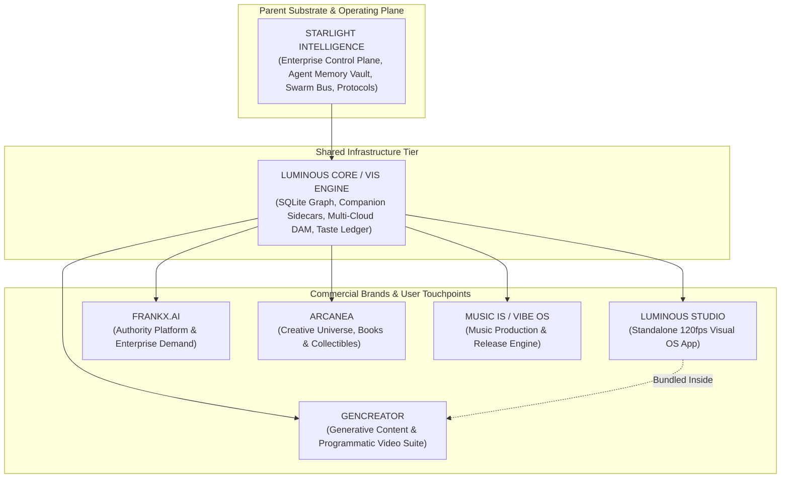

# LUMINOUS — Ecosystem Positioning, Packaging & Commercial Architecture

**Document Type:** Strategic Brand & Product Packaging Brief  
**Author:** Antigravity (Advanced Agentic Architecture)  
**Date:** 2026-09-16  
**Context:** Starlight Intelligence, GenCreator & Luminous Brand Interoperability  

---

## 1. The Strategic Question

> *"is this now separate from Starlight or GenCreator or should we rather bundle? Or is it good to have separate?"*

To answer this with maximum commercial leverage and architectural clarity, we examine how the three entities relate:

---

## 2. Definitive Recommendation: The "Modular Standalone + Suite Hub" Model

We should adopt the **Adobe / Apple Architectural Model** (like *Lightroom vs. Creative Cloud* or *Final Cut Pro vs. Pro Apps Bundle*):

### Summary Formula:
> **Architecturally Sovereign (Standalone Engine) + Commercially Bundled (GenCreator Suite Powerhouse) + Powered by Starlight Substrate.**

Here is why this structure gives Frank the highest leverage:

### 1. Why the Core Engine Must Remain Estate-Wide (Powered by Starlight)
If Luminous were buried exclusively inside GenCreator's repository, it would break cross-estate leverage:
- **Arcanea** needs Luminous to manage its 40 Guardians, 20 Luminors, character forge art, and IPFS token metadata.
- **FrankX.AI** needs Luminous to manage high-conversion web heroes, blog headers, and Vercel Blob sync.
- **Music IS** needs Luminous to manage Spotify Canvas loops, album covers, and audio stems.
- **Starlight** needs Luminous to provide the local SQLite graph (`vis.sqlite`) that all agents query via MCP.

**Verdict:** The underlying database, sidecar engine, and DAM router remain **sovereign and universal** under Constellation 5 (*Assets, Lore & Knowledge*).

---

### 2. The User & Commercial Packaging: Standalone vs. Bundled

From a creator's and user's perspective, Luminous succeeds through a **Dual-Surface Offering**:

#### A. Standalone Surface: **LUMINOUS STUDIO** (The Focused Visual Mission Control)
- **What it is:** A standalone desktop app (Tauri 2.0 `.exe`) and lightweight web app running at `localhost:9119`.
- **Why it must exist standalone:**
  - When Frank is exploring image generations, ranking prompts, or reviewing art, he wants an instant, laser-focused tool—not a heavy, bloated multi-track video editing suite.
  - Just like Figma exists separately from Webflow, or Lightroom exists separately from Premiere Pro: **browsing, curating, and prompt-forking requires a dedicated, clutter-free canvas.**
- **Commercial Potential:** Can be offered as a standalone $0/open-source or premium tier tool for AI creators, prompt engineers, and design studios seeking an AI-native alternative to Eagle.

#### B. Bundled Surface: **THE GENCREATOR VISUAL ENGINE** (The Creative Powerhouse)
- **What it is:** The native visual intelligence and media browser embedded directly inside GenCreator Studio.
- **Why bundling creates massive value:**
  - GenCreator Studio focuses on **Media Lab & 3D WebGL** (`starlight-remotion-lab`, `starlight-liquid`, programmatic video, cinematic animations).
  - Without Luminous, GenCreator is a video renderer with no asset memory or prompt library.
  - With Luminous, GenCreator becomes an **all-in-one generative studio**:
    - **Step 1 (Luminous):** Agents generate, founder ranks keepers, prompt lineage is preserved, assets are organized in the DAM.
    - **Step 2 (GenCreator):** The creator selects approved Luminous assets and instantly sequences them into Remotion video timelines, adds liquid glass shaders, and renders 4K releases.
- **Packaging:** *GenCreator Pro Bundle* includes Luminous Studio out of the box.

---

## 3. Clear Brand Positioning Matrix

| Entity | What It Is | Who Sees It | Primary Function |
| :--- | :--- | :--- | :--- |
| **Starlight Intelligence** | Parent Substrate & Control Plane | The Swarm, Enterprise, Frank | Protocols, Queen Swarm, Memory Vault, Orchestration |
| **GenCreator** | Creative Production & Video Suite | Public Creators, Video Producers | Programmatic Remotion video, Motion design, Generative pipelines |
| **Luminous Studio** | AI-Native Visual OS & DAM | Artists, Prompt Engineers, Frank | 120fps fly-through gallery, prompt lineage, live agent tray, taste learning |
| **FrankX.AI** | Flagship Personal & Enterprise Brand | Clients, Executives, Audience | Thought leadership, AI consulting, digital products, newsletters |
| **Arcanea** | Fiction IP & Worldbuilding Universe | Readers, Gamers, Collectors | Lore, character forge, 10-Gate progression, books |

---

## 4. Architectural Rules of Engagement

1. **One Source of Truth (SSOT):**
   - The master graph database (`data/vis.sqlite`) and central ledger (`image-generation-ledger.jsonl`) remain strictly owned by `visual-intelligence`. Neither GenCreator nor Arcanea duplicates this database.
2. **Universal Client Access:**
   - Both the standalone Luminous Studio app and GenCreator Studio read from the exact same local WebSocket event bus (`ws://localhost:9119/stream`) and MCP server (`vis-mcp-server.mjs`).
3. **No Code Duplication:**
   - GenCreator imports the Luminous media picker as a reusable React component (`@luminous/react-canvas` or `@starlight/vis-client`).
4. **Taste Ledger Convergence:**
   - Curation actions in Luminous, GenCreator, or Arcanea all write back to the same unified ledger: `C:/Users/frank/starlight/ops/TASTE_FEEDBACK_LEDGER.jsonl`.
