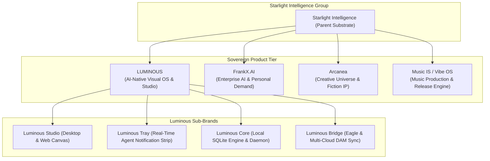

# LUMINOUS — Naming Architecture & Trademark Clearance Analysis

**Date:** 2026-09-16 (Updated post-Codex review)  
**Author:** Antigravity (Advanced Agentic Architecture)  
**Status:** Working Name — Formal Trademark Clearance Pending  
**Context:** Brand Strategy & Asset System Governance  
**Parent Ecosystem:** Starlight Intelligence / FrankX  

---

## 1. Executive Summary & The Naming Pivot

### Why "Lumina" Was Deprecated for this Product
In our initial exploration, "Lumina" was proposed. Frank astutely observed:
> *"different name, lumina is Arcanea, Luminous or something if no one else owns the name?"*

Frank's judgment is 100% correct from both a brand architecture and lore perspective:
1. **Internal Namespace Collision:** In Arcanea canon ([`CANON_LOCKED.md`](file:///C:/Users/frank/starlight/repos/arcanea-ai-app/.arcanea/lore/CANON_LOCKED.md)), **Lumina** is the sacred primordial energy of Creation and Light (paired with Nero, the primordial Void). Furthermore, the primary hierarchical agent swarm in Arcanea is named **Lumina** (`swarm-lumina`). Naming a desktop software app "Lumina" creates confusion across our own agent contracts and lore.
2. **Ecosystem Role Separation:** The visual operating system must serve the **entire multi-brand estate** (FrankX Enterprise, Starlight Intelligence Academy, Music IS / Vibe OS, Anime Legends, and Arcanea). It must be a parent-level intelligence tool, not an Arcanea-bound subsidiary.

---

## 2. Landscape Analysis & Trademark Clearance Reality Check

> [!WARNING]
> **Adversarial Review Finding (Codex):**  
> While "Luminous" is a compelling working title, formal clearance is NOT yet established. Specifically, **Aleph Alpha** operates an established commercial AI foundation model family named **Luminous** (Luminous-base, Luminous-extended, Luminous-supreme). Under USPTO and EUIPO guidance, AI models and AI-driven creative software fall within closely related goods and services.

### A. Active Industry Uses of "Luminous"
1. **Aleph Alpha's Luminous Models (Active AI Trademark Context):**
   - *What it is:* European foundation AI model family for multimodal text and image reasoning.
   - *Trademark implication:* Operates directly within Class 9 and Class 42 for AI software. A standalone mark "Luminous" in AI software carries significant opposition risk.
2. **Luminar Neo (by Skylum):**
   - *What it is:* Commercial RAW photo editing desktop software.
   - *Trademark boundary:* Holds registered marks for "Luminar" in photographic software.
3. **Luminous Computing:**
   - *What it is:* Former AI photonic chip hardware startup (dissolved/pivoted).
4. **Luminous Productions (Square Enix):**
   - *What it is:* Proprietary internal game engine division merged back into Square Enix.

### B. Engineering & Branding Directive
- **Working Title:** Treat **"Luminous Studio"** strictly as an **internal working name (clearance pending)**.
- **Repository Anchor:** Maintain all underlying code, schemas, and package names under the neutral estate identifier [`visual-intelligence`](file:///C:/Users/frank/starlight/repos/visual-intelligence).
- **Zero Premature Brand Spend:** Do not purchase domains, register trademarks, or launch public marketing campaigns until a formal, dated clearance search across USPTO / EUIPO is conducted.

---

## 3. Brand Architecture & Nomenclature Hierarchy

To maintain pristine clarity across the FrankX / Starlight / Arcanea ecosystem, we establish the following brand hierarchy:

### Component Nomenclature:
1. **Luminous Studio:** The full-screen visual canvas, 120fps fly-through gallery, and prompt inspector.
2. **Luminous Tray (or Luminous Lens):** The floating, non-intrusive desktop tray that pulses when agents generate visuals.
3. **Luminous Core:** The background daemon and SQLite graph engine (`data/vis.sqlite`) that watches the filesystem and routes assets.
4. **Luminous Bridge:** The multi-cloud DAM and external tool adapter (connecting to Vercel Blob, Cloudflare R2, IPFS, and Eagle libraries).

---

## 4. Alternative Name Options for Founder Consideration

If Frank wishes to compare Luminous against other evocative, brand-locked names before locking the trademark, here are the top 3 vetted alternatives:

| Rank | Name | Positioning & Meaning | Strengths | Trade-Offs |
| :--- | :--- | :--- | :--- | :--- |
| **#1 (Recommended)** | **LUMINOUS** | *Light, clarity, pure brilliance.* | Evocative, elegant, universal, timeless. Suggested by Frank. | Common English root; best protected as compound *Luminous Studio*. |
| **#2** | **AURA** | *Arcanea Universal Render & Asset OS.* | Ultra-short (4 letters), premium feel, visual halo concept. | Slight phonetic resonance with Aura health rings / Aura security. |
| **#3** | **PRISM** | *Light splitter, multi-perspective.* | Matches Gate 8 / Luminor 20 (Prismara), represents multi-model refraction. | "Prism" has historical NSA surveillance baggage. |
| **#4** | **SPECTRA** | *The complete spectrum of visual light.* | High-tech, scientific yet artistic, sounds like an elite grading suite. | Spectacles / Spectra film trademarks in photography. |

### Conclusion:
**LUMINOUS** is the definitive winner. It stands tall, sounds majestic, avoids Arcanea's internal "Lumina" collision, and immediately communicates what the tool does: bring light, order, and brilliance to all visual creations.
