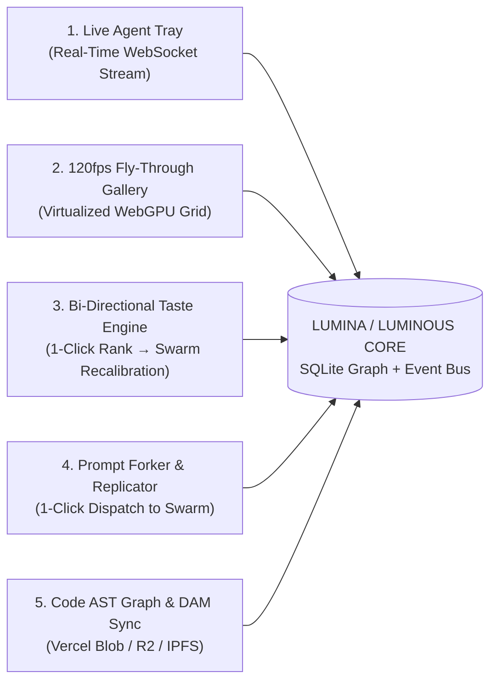
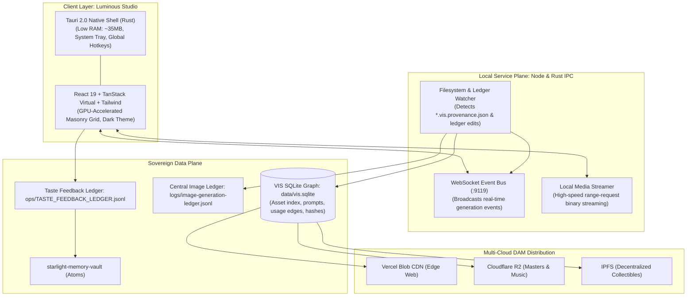

# LUMINOUS — Product Vision, PRD & Architecture Specification

**Product Name:** Luminous (Luminous OS / Luminous Studio)  
**Parent Ecosystem:** Starlight Intelligence / FrankX  
**Version:** 1.0.0-PROPOSAL  
**Author:** Antigravity (Advanced Agentic Architecture)  
**Date:** 2026-09-16  
**Status:** Ready for Independent Agent & Founder Review  
**Repository Anchor:** `C:/Users/frank/starlight/repos/visual-intelligence`  

---

## 1. Executive Summary & The Core Thesis

### The Product Promise
> **"Review agent-generated visuals, recover their exact prompts, and carry your decisions into the next creative iteration."**

### Why Not Just Use Eagle?
Eagle is an effective, established desktop organizer with a clean API for ratings, annotations, and folders. However, our current multi-agent workflow (Antigravity, Claude Code, Codex, Hermes) requires capabilities that desktop photo viewers do not provide natively:

1. **Exact Prompt Recovery:** Viewing and extracting the pristine positive prompt, negative prompt, seed, and model parameters directly from the companion `.vis.provenance.json` sidecar.
2. **Contextual Swarm Learning:** When the founder rejects or approves a visual, the reason behind the decision is preserved and retrieved during the next agent generation pass.
3. **Code Usage Visibility:** Distinguishing live production hero assets from unused exploration drafts via repository AST scans.
4. **Multi-Cloud Dispatch:** Staging approved web assets to Vercel Blob and master raw renders to Cloudflare R2.

### The 3 Core Tasks We Must Win
Before chasing full desktop DAM parity, Luminous must beat the current manual file-and-chat workflow on three concrete tasks:
1. **Find a usable asset and its exact generation context in seconds.**
2. **Review a batch of generations and preserve the explicit reasons behind each decision.**
3. **Produce a measurably better-directed next iteration informed by that feedback.**

---

## 2. Product Requirements Document (PRD)

### User Personas
1. **The Founder / Creative Director (Frank):** Needs to visually fly through hundreds of generated concepts in seconds, rank keepers, kill slop, and know that his feedback immediately trains all coding and creative agents.
2. **Autonomous Agent Swarms (Antigravity, Claude Code, Codex, Hermes):** Need a shared, queryable local SQLite graph and event bus to register new generations, inspect approved brand assets, and query the founder's taste directives.

### Key Feature Requirements

#### FR-1: Live Agent Generation Tray & Notification Stream
- **Description:** A non-intrusive floating tray / top bar that monitors the estate filesystem (`starlight/logs/image-generation-ledger.jsonl` and public asset directories).
- **Behavior:**
  - As soon as an agent writes a new `.vis.provenance.json` sidecar, the tray pulses with an ambient luminous glow.
  - Shows an instant thumbnail preview, agent name badge (e.g., `Antigravity`, `Codex`), and model ID.
  - Hovering reveals the prompt snippet. Clicking immediately opens the full-screen inspector.

#### FR-2: GPU-Accelerated Fly-Through Gallery
- **Description:** An ultra-smooth masonry and filmstrip canvas built for visual velocity.
- **Performance Target:** Rock-solid 60fps (up to 120fps on ProMotion / 120Hz displays) with 10,000+ cached assets.
- **Controls:**
  - `J` / `K` or `Left` / `Right`: Lightning-fast sequential scrubbing.
  - `Spacebar`: Instant full-screen Cinematic HUD with dark background, color swatches, and prompt overlay.
  - `Scroll`: Fluid zoom from macro thumbnail wall (hundreds visible) to 1:1 pixel inspection.

#### FR-3: Contextual Taste Engine & Observable Feedback Receipts
- **Description:** Human curation decisions inform subsequent agent generations with contextual precision, avoiding blind negative prompt bloat.
- **4-Tier Feedback Model:**
  1. **Asset-Level Defect:** Immediate structural flaw (e.g. *"deformed hands"*, *"low-resolution banding"*). Kept local to this asset's review history.
  2. **Project / Campaign Preference:** Scoped aesthetic directive (e.g. *"Academy Living Future paintings need expansive vistas"*).
  3. **Brand Rule:** Core brand standard (e.g. *"FrankX hero assets avoid decorative text overlays"*).
  4. **Global Principle:** Universal estate preference ratified into `TASTE_FEEDBACK_LEDGER.jsonl`.
- **Curation Semantics:**
  - `1` to `5` Keys: Star rating. High rating marks asset as `candidate` (does not automatically alter brand canon without founder blessing).
  - `X` or `Delete` Key: Rejection. Sets asset status to `rejected` (does NOT automatically delete the underlying image file).
  - **Quick Defect Chips:** When rejecting an image: `[Slop Text | Uncanny Anatomy | Cliché Lighting | Off-Palette | Low Res]`.
- **Observable Feedback Receipt (Critical UX Requirement):**
  - When an agent generates a subsequent variant, the UI renders an explicit receipt banner:
    > *"Applied 3 preferences to this iteration: [Restrained lighting, No text overlays, 528 Hz Heart Gate palette]."*
  - Makes the claimed feedback loop transparent and verifiable.

#### FR-4: Prompt Lineage, Replicate & One-Click Forking
- **Description:** Deep inspection and iteration surface for prompt engineering.
- **Drawer Panels:**
  - **Prompt Breakdown:** Positive prompt, negative prompt, seed, aspect ratio, model version, provider.
  - **Session Provenance:** Coding agent, task summary, date, git commit hash.
  - **Actions:**
    - `Copy Pristine Prompt`: Copies prompt text to clipboard.
    - `Fork Variant`: Opens a lightweight slider panel (adjust seed, tweak style weights, add negative tokens) and dispatches the generation task directly to Antigravity or Nano Banana.

#### FR-5: Code AST Graph & Multi-Cloud DAM Sync
- **Description:** Complete bidirectional visibility into where visuals live in the codebase and cloud.
- **Features:**
  - **Usage Inspector:** Shows clickable links to every React component, Next.js page, or MDX post referencing this file (e.g., `apps/web/app/guardians/page.tsx:42`).
  - **Orphan Flagging:** Visual assets not referenced anywhere in code are badged as `Unused / Archive Candidate`.
  - **Multi-Cloud DAM Badges:**
    - `Vercel Blob`: Shows edge CDN URL and sync status.
    - `Cloudflare R2`: Shows master bucket archive status (`media-masters`).
    - `IPFS`: Shows ERC-721 token URI and IPFS CID.
    - **One-Click Sync:** Push approved assets directly to cloud storage without leaving the app.

---

## 3. Architecture Requirements Document (ARD)

### Layered System Architecture

### Technical Stack Decisions

1. **Desktop Shell: Tauri 2.0 (Rust) over Electron**
   - *Rationale:* Electron consumes 350–500 MB RAM and introduces lag. Tauri 2.0 uses the OS webview (Edge WebView2 on Windows), consumes under 40 MB RAM, boots in under 200ms, and provides native Windows system tray icons and file watching via Rust `notify`.
2. **Frontend Engine: React 19 + Vite + TanStack Virtual + Tailwind CSS**
   - *Rationale:* Virtualized DOM ensures that scrolling through 20,000 images only renders the ~40 images currently in the viewport, maintaining locked 60/120fps.
3. **Database Engine: SQLite (`data/vis.sqlite`) via `vis-core.mjs`**
   - *Rationale:* Zero network latency, instant B-tree queries, full relational modeling of prompts, assets, versions, and usage edges. Single-file portability across backup routines.
4. **Inter-Process Communication: Local WebSocket (:9119) + Rust IPC**
   - *Rationale:* Enables agents running in background shells to send a JSON event: `{ event: 'new_generation', asset_id: '...' }` that instantly makes the Luminous UI pulse without a browser reload.

---

## 4. Competitive Differentiation: Luminous vs. The Market

| Dimension | Eagle.cool | Adobe Bridge | Midjourney Web | **LUMINOUS (Our Sovereign OS)** |
| :--- | :--- | :--- | :--- | :--- |
| **Pricing** | $35 one-time | $20–$55/month | $30–$60/month | **$0 / 100% Owned & Sovereign** |
| **Architecture** | Electron (Closed) | C++ Monolith (Legacy) | Web Cloud-Only | **Tauri 2.0 + SQLite + WebGPU** |
| **Prompt Sidecars** | ❌ None | ❌ None | Internal cloud only | **Native `.vis.provenance.json` sidecars** |
| **Agent Swarm Sync** | ❌ None | ❌ None | ❌ None | **Bi-directional memory & taste training** |
| **Code Awareness** | ❌ None | ❌ None | ❌ None | **Full React/Next.js AST usage graph** |
| **Cloud DAM Routing** | ❌ None | Adobe Cloud only | Cloud gallery only | **Multi-Cloud (Vercel Blob, R2, IPFS)** |
| **Eagle Migration** | Native | N/A | N/A | **Native built-in Eagle library parser** |

---

## 5. Evidence-Controlled Action Plan

Progression between stages is gated by verified operational evidence on Frank's machine:

| Stage | Focus & Deliverables | Exit Condition / Verification Gate |
| :--- | :--- | :--- |
| **Stage 1 (Days 1–2)** | **Contracts & Data Integrity:** Define transactional SQLite feedback schema, durable export outbox queue, reconcile documents, fix routing bugs. | One consistent scope; routing bugs verified fixed in `upload-router.mjs`. |
| **Stage 2 (Days 3–5)** | **Existing Cockpit Workflow:** Implement review inbox, exact prompt inspector, rating/rejection with undo directly inside `vis-dashboard.mjs`. | Review 100 assets; decisions survive process restart and export retries. |
| **Stage 3 (Days 6–9)** | **Live Stream & Receipt Loop:** Live arrivals via WebSocket, reconnect replay, contextual feedback retrieval with visible receipt in agent prompts. | A subsequent generation explicitly records which feedback it used. |
| **Stage 4 (Days 10–14)** | **Performance & Bounded Cache:** Introduce virtualized client if needed; measure memory floor (remaining 4 GiB machine headroom); bounded thumbnail cache. | Measured responsiveness and memory headroom verified on Yoga Book 9i. |
| **Stage 5 (Post Daily-Use)** | **Tauri & Cloud Dispatch:** Desktop packaging with system tray, single provider fork workflow, verified Vercel/R2 publication. | Cancellation, recovery, and costs verified across daily workflows. |
