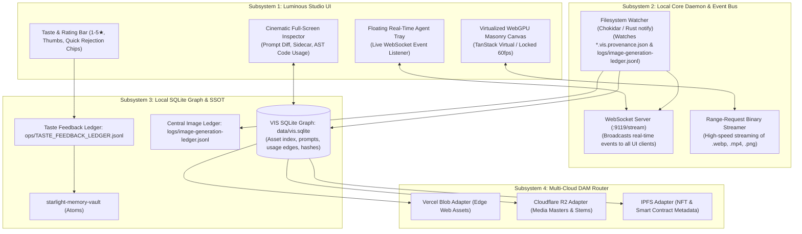

# LUMINOUS — Technical Architecture, Data Contracts & Execution Roadmap

**Document Type:** Technical Architecture Document (TAD) & Sprint Roadmap  
**Status:** Engineering Ready  
**Date:** 2026-09-16  
**Reference Implementations:** `starlight/repos/visual-intelligence`  
**Target Platform:** Windows 11 (Lenovo Yoga Book 9i / C940) + Cross-Platform Web  

---

## 1. Subsystem Architecture

LUMINOUS is architected into four decoupled, highly optimized subsystems:



---

## 2. Event Bus & Live Generation Stream Contract

### WebSocket Protocol Specification (`ws://localhost:9119/stream`)

When any agent generates an asset, it either:
1. Calls the VIS MCP server (`toolRecordGenerationProvenance`), OR
2. Directly writes `<image_name>.vis.provenance.json` and appends `image-generation-ledger.jsonl`.

The Luminous Core Daemon detects this write in < 50ms and emits a typed WebSocket message:

```json
{
  "type": "NEW_GENERATION",
  "version": "1.0.0",
  "timestamp": "2026-09-16T17:50:00.000Z",
  "payload": {
    "asset_id": "asset:01-solara-dawn-keeper",
    "title": "Solara — The Dawn Keeper",
    "media_type": "image",
    "thumbnail_url": "/media-proxy/preview?path=apps/web/public/images/luminors/01-solara-dawn-keeper.webp",
    "local_path": "C:/Users/frank/starlight/repos/arcanea-ai-app/apps/web/public/images/luminors/01-solara-dawn-keeper.webp",
    "sidecar_path": "C:/Users/frank/starlight/repos/arcanea-ai-app/apps/web/public/images/luminors/01-solara-dawn-keeper.vis.provenance.json",
    "prompt": "Evolved sentinel Solara, The Dawn Keeper. Solar warrior of radiant living gold-alloy...",
    "model": "nano-banana-pro",
    "provider": "antigravity",
    "agent": "antigravity",
    "session_ref": "7ba26976-f949-4efd-85bb-97f4069f7bf0",
    "gate_frequency": "174 Hz",
    "brand": "arcanea"
  }
}
```

The **Luminous Tray** immediately renders this incoming asset with a subtle glowing pulse. Clicking it slides the item into the main canvas.

---

## 3. Bi-Directional Taste Loop Data Contract

When Frank rates, favorites, or rejects an asset in Luminous, the app emits an action payload to `taste-feedback.mjs`:

```json
{
  "timestamp": "2026-09-16T17:55:00.000Z",
  "action": "REJECT",
  "asset_id": "asset:test-hero-variant-3",
  "rating": 1,
  "defects": ["slop-gradient", "uncanny-hands", "cliche-lighting"],
  "user_note": "Gradient feels cheap and synthetic. Hands are deformed.",
  "prompt_context": {
    "prompt": "Cyberpunk warrior standing in neon city...",
    "model": "nano-banana-pro",
    "seed": 98765
  },
  "feedback_type": "negative_critique",
  "actor": "frank"
}
```

### Swarm Feedback & Ingestion Pipeline:
1. **Validation & SQLite Transaction:** Feedback action is validated and committed to SQLite in a single transaction with unique event ID, schema version, asset revision, and actor.
2. **Durable Outbox Export Queue:** Unfinished ledger appends and memory-vault syncs are recorded in an SQLite outbox table (`feedback_outbox`) so that network hiccups or process restarts do not lose curation data.
3. **Outbox Workers:** Durable workers drain the queue into [`TASTE_FEEDBACK_LEDGER.jsonl`](file:///C:/Users/frank/starlight/ops/TASTE_FEEDBACK_LEDGER.jsonl) and [`starlight-memory-vault`](file:///C:/Users/frank/starlight/repos/starlight-memory-vault) with idempotency.
4. **Contextual Retrieval (Not Blind Appends):** Feedback is scoped into 4 tiers:
   - *Asset-level defect:* Recorded in asset provenance history.
   - *Project-level preference:* Retrieved when generating for that specific campaign.
   - *Brand-level rule:* Retrieved when generating for that brand (e.g. FrankX or Arcanea).
   - *Global principle:* Ratified into root taste doctrines.
5. **Visible Learning Receipt:** When generating a subsequent variant, the agent prompt critic injects a human-observable receipt:
   > *"Applied 3 preferences to this prompt: [Restrained lighting, No decorative text, 528 Hz Heart Gate palette]."*

---

## 4. Multi-Cloud DAM Ingestion & Upload Router Contract

In [`starlight/repos/visual-intelligence/core/adapters/upload-router.mjs`](file:///C:/Users/frank/starlight/repos/visual-intelligence/core/adapters/upload-router.mjs), routing rules enforce explicit publication intent and exact repo matching:

```javascript
// Verified Routing Logic Matrix
export function routeAssetDestination(asset) {
  const brand = detectAssetBrand(asset)
  const explicitNftIntent = asset.workflow === 'nft-mint' || (asset.tags || []).includes('nft-mint-ready') || asset.category === 'nft-collection' || asset.target_storage === 'ipfs-nft'
  const isNft = explicitNftIntent && (asset.approval_status === 'approved' || asset.category?.includes('nft'))
  const isMusic = asset.workflow === 'music-release' || asset.media_type === 'audio' || ['cover-art', 'music-canvas', 'music-stem'].includes(asset.media_role) || asset.category === 'music-releases'
  const isWebHero = (asset.tags || []).includes('hero') || asset.workflow === 'website' || (asset.usage_count && Number(asset.usage_count) > 0)
  const isVideo = asset.media_type === 'video'

  if (isMusic) {
    return { primary: 'cloudflare-r2', target_bucket: 'music-releases' }
  } else if (isNft) {
    return { primary: 'ipfs-nft', target_bucket: 'public-cdn' }
  } else if (isWebHero && brand === 'frankx') {
    return { primary: 'vercel-blob', target_bucket: 'public-cdn' }
  } else {
    return { primary: 'cloudflare-r2', target_bucket: 'media-masters' }
  }
}
```

---

## 5. Evidence-Controlled 5-Stage Execution Plan

Progression between stages is strictly controlled by operational evidence on Frank's machine:

| Stage | Deliverable | Exit Condition |
| :--- | :--- | :--- |
| **Stage 1 (Days 1–2)** | **Contracts & Data Integrity:** Reconcile documents, define feedback schema and durable export queue in SQLite, verify router bug fixes. | One consistent scope; routing fixes verified in `upload-router.mjs`. |
| **Stage 2 (Days 3–5)** | **Existing Cockpit Workflow:** Review inbox, exact prompt inspector, rating/rejection with undo directly in `vis-dashboard.mjs`. | Review 100 assets; decisions survive restart and export retries. |
| **Stage 3 (Days 6–9)** | **Live Stream & Receipt Loop:** Live arrivals via WebSocket, reconnect replay, contextual feedback retrieval with visible receipt. | A subsequent generation explicitly records which feedback it used. |
| **Stage 4 (Days 10–14)** | **Performance & Bounded Cache:** Virtualized DOM client if needed; measure remaining 4 GiB machine headroom; capped thumbnail cache. | Measured responsiveness and memory headroom on Lenovo Yoga Book 9i. |
| **Stage 5 (Post Daily-Use)** | **Tauri & Cloud Dispatch:** Desktop packaging with system tray, single provider fork workflow, verified Vercel/R2 publication. | Cancellation, recovery, and costs verified across daily workflows. |

---

## 6. Review Checklist for Peer Agents (Codex / Claude Code)

When another agent reviews this architecture, it should evaluate:
- [ ] **Memory Floor:** Does the architecture honor Frank machine's 4 GiB remaining RAM floor contract under real thumbnail decoding?
- [ ] **Data Durability:** Does the SQLite transaction + durable outbox queue guarantee zero lost feedback across process restarts?
- [ ] **Contextual Prompting:** Does the 4-tier feedback model prevent contradictory negative prompt bloat?
- [ ] **Routing Accuracy:** Does `upload-router.mjs` correctly distinguish FrankX assets from Starlight estate paths without false positives?
