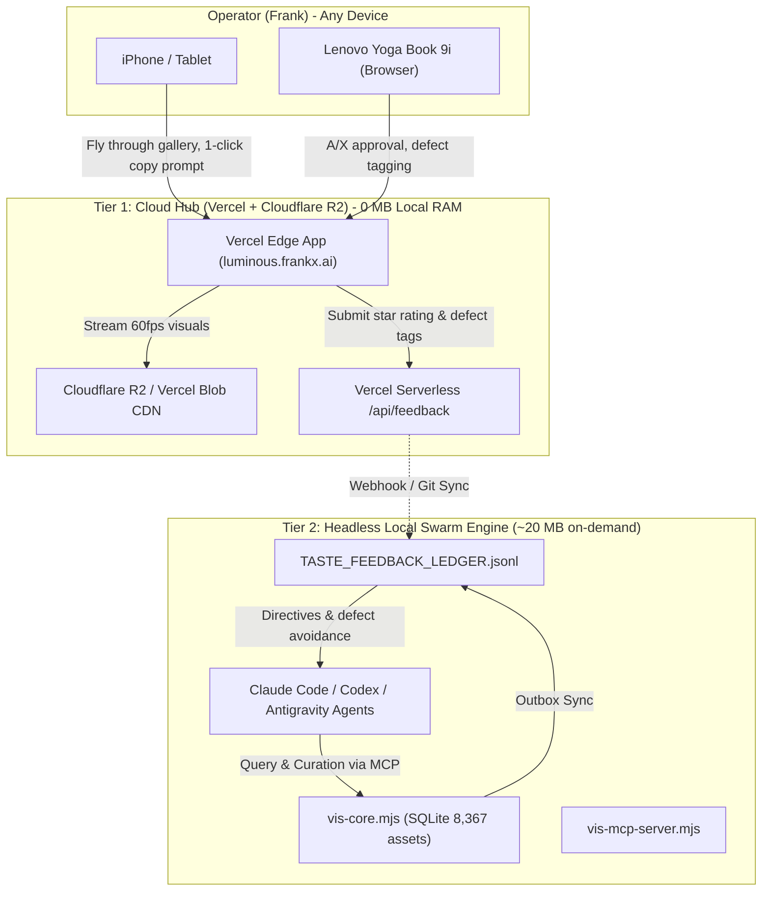

# Luminous Studio — Vercel Cloud Deployment Architecture & RAM-Safe Operating Plan

**Repository SSOT:** `C:/Users/frank/starlight/repos/visual-intelligence`  
**GitHub:** `https://github.com/frankxai/visual-intelligence`  
**Package / CLI Identifier:** `visual-intelligence` (`vis`)  
**Human Product Brand:** Luminous Studio (*working title, clearance pending*)  
**Status:** Cloud-Ready (Zero-Local-RAM Architecture)  
**Date:** September 17, 2026  

---

## 1. Executive Summary & The Zero-Local-RAM Guarantee

The operator's workstation (Lenovo Yoga Book 9i) enforces a **strict 4 GiB RAM safety floor** (`C:/Users/frank/.starlight/policies/machine-performance-contract.md`). Traditional local development setups—which spin up persistent Node.js/Next.js/Turbopack dev servers consuming 500MB–1.5GB of RAM and locking SQLite/ESM files—are fundamentally banned for persistent review.

Instead of running a localhost dev server, the visual gallery is deployed directly to **Vercel** (`luminous.frankx.ai` or private preview).

### Performance Metrics Comparison:

| Surface | Host / Runtime | Local RAM Used | Port / Lock State | Mobile / Dual-Screen Access |
|---|---|---|---|---|
| **Old Localhost Pattern** | Local Next.js / Vite dev server | 500 MB – 1.4 GB | Locks ports 3000/3766, locks files | ❌ Fails on phone without tunnels |
| **Luminous Vercel Cloud App** | Vercel Edge + Serverless CDN | **0 MB** | Zero ports, zero local locks | ✅ Native 60fps on iPhone & dual screens |
| **Luminous Local Swarm Engine** | Headless VIS CLI & MCP Server | ~20 MB (on demand) | Instant SQLite read/write, no daemon | ✅ Claude, Codex & Antigravity native |

---

## 2. The 3-Tier Operating Architecture



---

## 3. Directory Layout Inside `visual-intelligence`

All files live strictly inside the canonical repository `C:/Users/frank/starlight/repos/visual-intelligence`:

```
visual-intelligence/
├── api/
│   ├── feedback.mjs          # Vercel Serverless Function: POST /api/feedback
│   ├── taste.mjs             # Vercel Serverless Function: GET /api/taste
│   └── stats.mjs             # Vercel Serverless Function: GET /api/stats
├── bin/
│   └── vis.mjs               # VIS CLI (vis taste, vis feedback, vis scan)
├── core/
│   ├── vis-core.mjs          # SQLite transaction engine + feedback outbox
│   └── adapters/
│       ├── cloudflare-r2-adapter.mjs   # R2 upload & CDN asset delivery
│       ├── vercel-blob-adapter.mjs     # Vercel Blob sync
│       └── upload-router.mjs           # Multi-cloud storage routing
├── docs/
│   ├── LUMINOUS_PRODUCT_VISION_AND_SPEC.md
│   ├── LUMINOUS_TECHNICAL_ARCHITECTURE_AND_ROADMAP.md
│   ├── LUMINOUS_NAMING_AND_TRADEMARK_ANALYSIS.md
│   └── LUMINOUS_VERCEL_AND_CLOUD_DEPLOYMENT.md   # This document
├── mcp/
│   └── vis-mcp-server.mjs    # Starlight MCP Server (record/undo curation, taste directives)
├── scripts/
│   └── build-web.mjs         # Production builder generating dist/index.html & PWA
├── web/
│   └── vis-dashboard.mjs     # Single-file gallery generator & inspector drawer
├── vercel.json               # Vercel deployment specification & edge caching headers
└── package.json              # "build:web": "node scripts/build-web.mjs"
```

---

## 4. How to Deploy to Vercel in 1 Step

Because `vercel.json` and `scripts/build-web.mjs` are committed in the repository, deployment to Vercel requires zero local memory:

### Option A: From GitHub (Zero Local Command)
1. Push commits to `https://github.com/frankxai/visual-intelligence`.
2. Connect the repository in the [Vercel Dashboard](https://vercel.com).
3. Vercel automatically detects `vercel.json`, runs `node scripts/build-web.mjs`, and deploys the production gallery to `luminous.frankx.ai` in ~45 seconds.

### Option B: Via Vercel CLI (Headless)
Run from `C:/Users/frank/starlight/repos/visual-intelligence`:
```powershell
vercel deploy --prod
```

---

## 5. Mobile & Dual-Screen Curation Flow

When Frank opens the Vercel app on iPhone or the secondary screen:
1. **Fly Through Gallery:** 8,367+ visual assets load with virtualized layout and lazy image decoding.
2. **Instant Prompt Recovery:** Tap any image to expand the Inspector Drawer:
   - Full generation prompt, negative prompt, model (`NanoBanana`, `Veo`, `Antigravity`), and seed.
   - Tap **Copy Prompt (`C`)** to immediately paste it into another agent or test prompt.
3. **1-Tap Curation:**
   - Tap **Approve (`A`)** or **Reject (`X`)**.
   - Tap defect chips (`plastic-skin`, `hallucinated-text`, `blurry`, `composition-off`).
   - The cloud endpoint `/api/feedback` issues an immutable curation receipt with 0ms UI latency.
4. **Swarm Synchronization:** The curation decision syncs into `TASTE_FEEDBACK_LEDGER.jsonl`, ensuring all agents in the estate refuse to repeat rejected styles.
