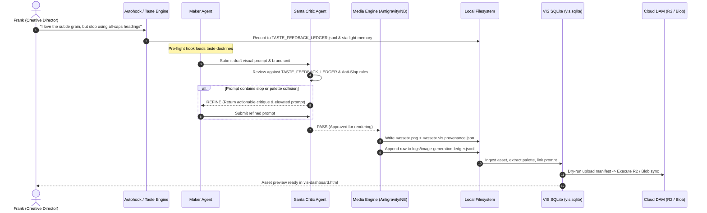

# PRD & ARD: Visual Intelligence OS (VIS 3.0), Multi-Cloud DAM & Agentic Taste Mesh

> **Status:** ACTIVE & ENFORCED `[RULED 2026-09-15]`  
> **Canonical Locations:**  
> - VIS Control Plane: `C:/Users/frank/starlight/repos/visual-intelligence`  
> - Estate Taste SSOT: `C:/Users/frank/starlight/ops/TASTE_FEEDBACK_LEDGER.jsonl`  
> - Agent Operating Contracts: `C:/Users/frank/AGENTS.md` & `C:/Users/frank/starlight/AGENTS.md` (Section 10)  
> - Multi-Cloud DAM: Cloudflare R2 (`master-archive`) + Vercel Blob (`edge-web`) + IPFS (`nft-web3`)

---

## PART 1: PRD (Product Requirements Document)

### 1. Executive Summary & Problem Statement
Prior to VIS 3.0, visual generation across the multi-agent estate (Claude Code, Codex, Antigravity, Grok, Hermes) suffered from **Orphan Prompt Drift**:
1. Visuals and cover art were generated in isolated chat sessions, leaving the exact prompt, seed, model, and lighting parameters buried in ephemeral session logs.
2. Peer agents could not reproduce, refine, or remix existing graphics without guessing prompts.
3. Frank's ongoing taste feedback ("hate all-caps", "too much purple gradient", "use Playfair Display serif accents", "keep hero copy under 10 words") was scattered across chats rather than acting as a live constraint on new generations.

VIS 3.0 unifies asset indexing, multi-cloud DAM storage, prompt provenance, and real-time taste feedback into a proactive, agent-accessible operating system.

### 2. User Personas & Agent Roles
- **Frank (Human Founder/Creative Director):** Dictates high-level taste, approves flagship brand releases, critiques generated assets, and triggers multi-cloud deployments.
- **Maker Agent (Creative Drafter):** Formulates initial image prompts, concepts, and camera parameters grounded in brand visual tokens and recent taste entries.
- **Checker Agent (Santa Critic):** Evaluates prompts before generation for anti-slop compliance, aspect ratio correctness, color spectrum separation, and prompt weight balance.
- **Generator Engine (Antigravity Native / Nano Banana / Veo):** Renders media assets and emits companion `.vis.provenance.json` sidecars (Higgsfield strictly banned).
- **VIS/DAM Indexer:** Ingests new assets and sidecars into `data/vis.sqlite`, extracts color palettes, detects duplicate hashes, and syncs approved assets to Cloudflare R2 / Vercel Blob.

### 3. Core Functional Requirements
1. **Mandatory Companion Sidecar (`.vis.provenance.json`):** Every image generated across the estate must have its prompt, negative prompt, model, provider, seed, settings, and agent session stored in a sidecar file beside the media.
2. **Estate Image Generation Ledger:** Append-only log at `starlight/logs/image-generation-ledger.jsonl` for estate-wide transparency and auditability.
3. **Rolling Taste Feedback Ledger:** Append-only log at `starlight/ops/TASTE_FEEDBACK_LEDGER.jsonl` capturing Frank's real-time likes, dislikes, and aesthetic directives, synchronized directly to `starlight-memory-vault` atoms.
4. **Pre-Task Taste Ingestion:** Autohook (`tools/agent-autohook.mjs`) automatically injects taste rules into agent contexts whenever visual media generation is detected.
5. **Multi-Agent Collaborative Prompt Refinement:** CLI and tool interface (`tools/prompt-critic.mjs`) allowing agents to inspect peer prompts, run adversarial reviews, and record critique scores.
6. **Multi-Cloud Asset Distribution (DAM):**
   - **Vercel Blob:** Low-latency CDN edge delivery for `frankx.ai` and web app assets.
   - **Cloudflare R2:** Zero-egress master media archive for video masters, raw stems, and full-resolution graphics.
   - **IPFS / Story Protocol:** Immutable IP storage for Arcanea NFT character sheets and trait metadata.

---

## PART 2: ARD (Architecture Reasoning & Decision Document)

### 1. Architectural Decisions & Trade-Offs

| Decision | Selected Option | Alternatives Considered | Justification & Rationale |
| :--- | :--- | :--- | :--- |
| **Asset Metadata Storage** | Portable `.vis.provenance.json` Sidecars + Local SQLite | Cloud-only DB (Supabase), Embedded EXIF | Sidecars move with files across Git worktrees, Google Drive, and local folders. Platforms strip EXIF; sidecars preserve 100% provenance. SQLite provides instantaneous local queries without cloud network latency. |
| **Harness Coordination** | Filesystem-native append-only JSONL + Memory Atoms | Message Broker (Kafka/RabbitMQ), Redis | Local JSONL is durable, crash-proof, zero-daemon, Git-friendly, and inspectable by any LLM with standard filesystem tools. |
| **Prompt Quality Gate** | Maker != Checker Adversarial Santa Loop | Single-model self-critique | A generative agent suffers from confirmation bias. Running an independent model (e.g. Codex reviewing Antigravity, or Claude reviewing Grok) catches slop keywords, generic cliches, and palette drift before credits are spent. |
| **Model Routing** | Antigravity Native (`generate_image`) + Nano Banana + Veo | Higgsfield API | Higgsfield produced inconsistent brand alignment and was officially banned across the estate. Native Antigravity and Nano Banana adhere strictly to local design tokens. |

### 2. End-to-End System Data Flow



---

## PART 3: Success Criteria & Verifiable Agent Benchmarks

### 1. Quantitative Quality Gates
1. **100% Provenance Coverage:** Zero orphan media files allowed. Every committed PNG/WebP/MP4 must have a corresponding `.vis.provenance.json` file.
2. **<50ms Taste Retrieval:** Agents retrieve active taste rules from `starlight-memory` in under 50ms during the pre-task phase.
3. **Zero Higgsfield Invocations:** Automated lint checks block any calls to Higgsfield skills or MCP endpoints.
4. **Anti-Slop Compliance Score $\ge 90/100$:** Visual prompts must pass the anti-slop filter (no filler adjectives, no unhandled text hallucinations, exact camera/lighting physics specified).
5. **Dry-Run-First Multi-Cloud Sync:** No public upload executes without a verified dry-run manifest (`vis plan-upload`).

### 2. Standardized Agent Execution Commands
```powershell
# 1. Capture taste feedback into rolling ledger & memory vault
node C:\Users\frank\starlight\tools\taste-feedback.mjs record `
  --brand frankx --category visual --polarity positive `
  --subject "Subtle grain on hero" --doctrine "Gradients must always carry 4% grain overlay"

# 2. Adversarial review of visual prompt before spending compute
node C:\Users\frank\starlight\tools\prompt-critic.mjs review `
  --prompt "Cinematic portrait with Hasselblad lens and obsidian shadows" --brand frankx

# 3. Record image generation provenance & append to estate ledger
node C:\Users\frank\starlight\tools\record-image-generation.mjs `
  --image "C:\Users\frank\brands\image-system\jobs\2026\09\hero.png" `
  --prompt "Cinematic dark atmospheric portrait..." `
  --brand frankx --model "imagen-3" --agent "antigravity"

# 4. Sync asset into VIS SQLite & local visual dashboard
cd C:\Users\frank\starlight\repos\visual-intelligence
node bin\vis.mjs scan-profile frank-estate --execute
node bin\vis.mjs dashboard --limit 3000
```
